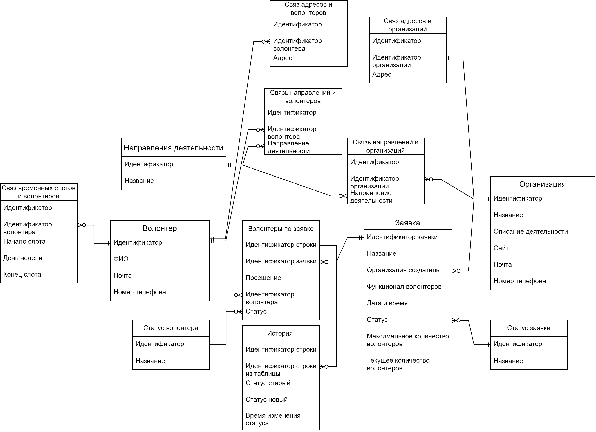

# Концептуальная модель данных

# Основные сущности и атрибуты

Опишем основные сущности и атрибуты, которыми они обладают детально.

## 1. Организация

| Сущность           | Атрибут                          | Тип данных   | Пример значения                                 |
|--------------------|----------------------------------|--------------|-------------------------------------------------|
| Организация        | ID                               | INT          | 13                                              |
|                    | Название                         | VARCHAR(255) | Фонд помощи детям                              |
|                    | Описание деятельности            | VARCHAR(2500)| Фонд помощи детям основан в таком-то году и осуществляет такую-то деятельность, сотрудничает с такими-то компаниями. |
|                    | Сайт                             | VARCHAR(255) | fondpomochi.ru                                  |
|                    | Почта                            | VARCHAR(255) | fondpomochi@yandex.ru                           |
|                    | Номер телефона                   | VARCHAR(10)  | 88005553535                                     |
|                    | Аватар                           | VARCHAR(500) | Ссылка на аватар организации                    |

Для организации еще необходимо хранить следующие данные: **адрес** и **направления деятельности**. Направлений деятельности может быть много, поэтому они будут храниться в отдельной таблице. **Связь**: **многие ко многим**.

У одной организации или волонтера может быть несколько сохранных адресов, поэтому данные об адресе будут храниться в отдельной таблице. **Связь**: **один ко многим**. 

Информацию об адресе организации я решила вынести в отдельную таблицу для удобства. Это позволит в будущем легко изменить логику системы, например, если потребуется, чтобы у организации было несколько адресов (например, филиалов).

## 2. Волонтер

| Сущность           | Атрибут                          | Тип данных   | Пример значения                                 |
|--------------------|----------------------------------|--------------|-------------------------------------------------|
| Волонтер           | ID                               | INT          | 13                                              |
|                    | Фамилия                         | VARCHAR(255) | Бургеркингов                                     |
|                    | Имя                              | VARCHAR(255) | Василий                                          |
|                    | Отчество                        | VARCHAR(255) |                                                 |
|                    | Почта                            | VARCHAR(255) | vasya@yandex.ru                                 |
|                    | Номер телефона                   | VARCHAR(10)  | 88005553535                                      |
|                    | Аватар                           | VARCHAR(500) | Ссылка на аватар волонтера                      |

У одного волонтера может быть несколько **временных слотов**, поэтому данные будут храниться в отдельной таблице. **Связь**: **один ко многим**.

## 3. Заявка

| Сущность           | Атрибут                          | Тип данных   | Пример значения                                 |
|--------------------|----------------------------------|--------------|-------------------------------------------------|
| Заявка             | ID                               | INT          | 13                                              |
|                    | Название                         | VARCHAR(255) | Посадка деревьев                                |
|                    | ID организации                   | INT          | 12                                              |
|                    | Функционал волонтеров            | VARCHAR(2500)| мыть пол, стирать белье, кормить белок         |
|                    | Дата и время начала              | DATETIME     | 2024-12-12 20:00                                |
|                    | Дата и время конца               | DATETIME     | 2024-12-12 22:00                                |
|                    | Максимальное количество волонтеров | INT        | 25                                              |
|                    | ID статуса заявки                | INT          | 2                                               |
|                    | Текущее количество волонтеров    | INT          | 12                                              |

**Примечание:** Атрибут "текущее количество волонтеров" дублирует данные, которые можно получить с помощью подсчета строк из таблицы "волонтеры по заявке". Денормализация в данном случае оправдана, так как позволяет повысить эффективность системы, показывая количество волонтеров в ленте заявок без выполнения дополнительных запросов к базе данных.

Также для заявки необходимо хранить информацию о волонтерах, которые записались, и о тех, кто встал в лист ожидания. **Связь:** **многие ко многим**. Один волонтер может записаться на несколько заявок, на одну заявку может записаться несколько волонтеров.

## 4. Статус заявки

| Сущность           | Атрибут                          | Тип данных   | Пример значения                                 |
|--------------------|----------------------------------|--------------|-------------------------------------------------|
| Статус заявки      | ID                               | INT          | 13                                              |
|                    | Название                         | VARCHAR(100) | отменена фондом                                 |

## 5. Направление деятельности

| Сущность           | Атрибут                          | Тип данных   | Пример значения                                 |
|--------------------|----------------------------------|--------------|-------------------------------------------------|
| Направление деятельности | ID                          | INT          | 13                                              |
|                    | Название                         | VARCHAR(100) | помощь животным                                 |

Для разрешения связи многие ко многим между парами сущностей "волонтер-направление" и "организация-направление" создадим дополнительную таблицу. В этой таблице добавим атрибут "тип объекта", который может принимать два значения: **волонтер** и **организация**.

## 6. Таблица связи направлений и пользователей

Таблица для волонтеров:

| Атрибут                | Тип данных   | Пример значения            |
|------------------------|--------------|----------------------------|
| ID                     | INT          | 13                         |
| ID волонтера            | INT          | 13                         |
| ID направления деятельности | INT      | 7                          |

Таблица для фондов:

| Атрибут                | Тип данных   | Пример значения            |
|------------------------|--------------|----------------------------|
| ID                     | INT          | 13                         |
| ID фонда               | INT          | 13                         |
| ID направления деятельности | INT      | 7                          |

## 7. Таблица связи адресов и пользователей

Таблица для волонтеров:

| Атрибут                | Тип данных   | Пример значения            |
|------------------------|--------------|----------------------------|
| ID                     | INT          | 13                         |
| ID волонтера            | INT          | 13                         |
| Адрес                  | VARCHAR(255) | ул. Пушкина д. 45          |

Таблица для фондов:

| Атрибут                | Тип данных   | Пример значения            |
|------------------------|--------------|----------------------------|
| ID                     | INT          | 13                         |
| ID фонда               | INT          | 13                         |
| Адрес                  | VARCHAR(255) | ул. Пушкина д. 45          |

## 8. Таблица временных слотов волонтеров

| Атрибут                | Тип данных   | Пример значения            |
|------------------------|--------------|----------------------------|
| ID                     | INT          | 13                         |
| ID волонтера            | INT          | 13                         |
| Время начала           | TIME         | 18:00                      |
| Время конца            | TIME         | 20:00                      |
| День недели            | VARCHAR(100) | пятница                    |

## 9. Таблица волонтеры по заявке

В этой таблице будут храниться данные о волонтерах, которые записались на эту заявку.

| Атрибут                | Тип данных   | Пример значения            |
|------------------------|--------------|----------------------------|
| ID                     | INT          | 13                         |
| ID заявки              | INT          | 13                         |
| ID волонтера            | INT          | 18                         |
| Статус                 | INT          | 1                          |
| Посещение              | INT          | 1                          |

Атрибут **Посещение**: значение 1 означает, что волонтер пришел, 0 — что не пришел.

## 10. Таблица статус волонтера

| Сущность             | Атрибут        | Тип данных  | Пример значения  |
|----------------------|----------------|-------------|------------------|
| Статус волонтера     | ID             | INT         | 13               |
|                      | Название       | VARCHAR(100)| в листе ожидания |

В таблице будут храниться следующие статусы: **записан**, **в листе ожидания**, **отказался**.

## 11. Таблица история записи

Для отчетности также будет заведена таблица, в которой будут дампиться все изменения статуса волонтеров по заявке.

| Атрибут                | Тип данных   | Пример значения            |
|------------------------|--------------|----------------------------|
| ID                     | INT          | 13                         |
| ID строки из таблицы "волонтеры по заявке" | INT | 13               |
| Статус старый          | INT          | 1                          |
| Статус новый           | INT          | 2                          |
| Время изменения        | TIME         | 20:00                      |

**Примечание:** ID строки из таблицы "волонтеры по заявке" уже хранит данные об ID волонтера и ID заявки, поэтому нет необходимости дублировать эти данные в таблице с историей.

**Итоговая модель:**
Представлена концептуальная модель

