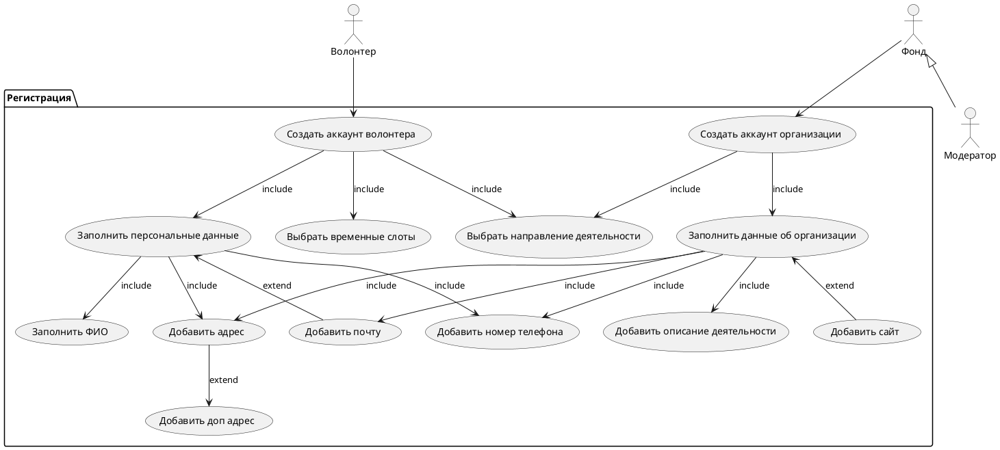

# Схема

```plantuml

@startuml

actor Волонтер as v

actor Фонд as f

actor Модератор as m

package Регистрация {

usecase "Создать аккаунт волонтера" as UC2

usecase "Заполнить ФИО" as UC3

usecase "Добавить адрес" as UC5

usecase "Добавить доп адрес" as UC6

usecase "Заполнить персональные данные" as UC7

usecase "Выбрать направление деятельности" as UC8

usecase "Выбрать временные слоты" as UC9

usecase "Добавить номер телефона" as UC10

usecase "Создать аккаунт организации" as UC11

usecase "Заполнить данные об организации" as UC12

usecase "Добавить сайт" as UC13

usecase "Добавить описание деятельности" as UC14

usecase "Добавить почту" as UC15

}

v --> UC2

f --> UC11

UC7 --> UC10: include

UC12 --> UC10: include

UC11 --> UC8: include

UC11 --> UC12: include

UC7 --> UC5: include

UC2 --> UC9: include

UC2 --> UC8: include

UC2 --> UC7: include

UC7 --> UC3: include

UC12 --> UC5: include

UC5 --> UC6: extend

UC12 <-- UC13: extend

UC12 --> UC14: include

UC12 --> UC15: include

UC7 <-- UC15: extend

f <|-- m

@enduml

```

Какой-то текст после диаграммы
