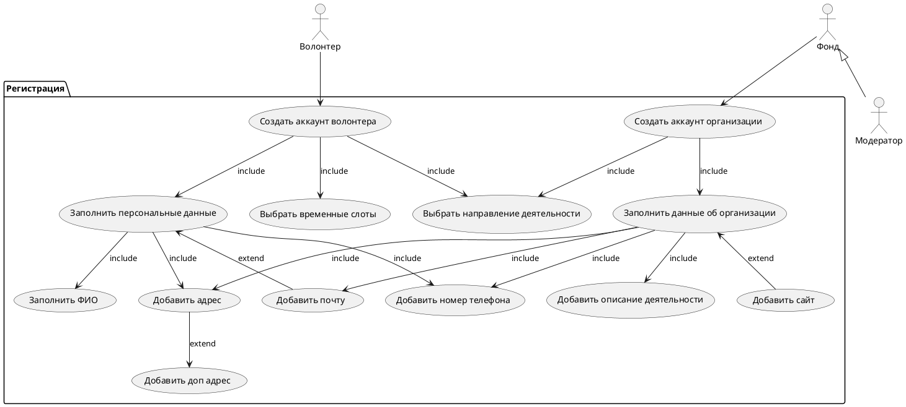
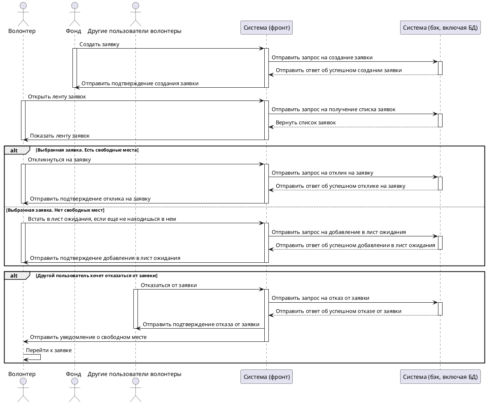
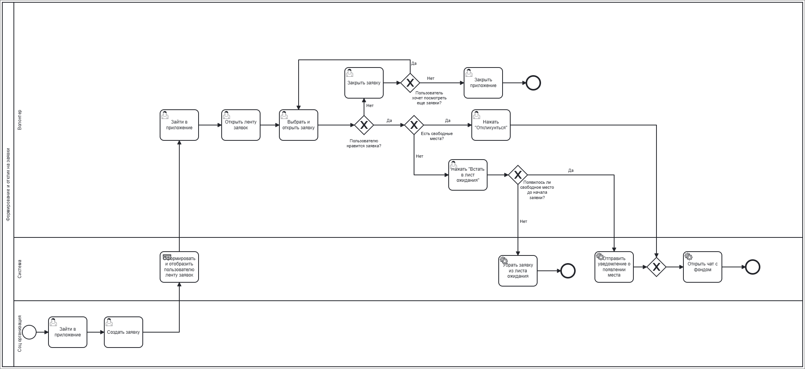

# Схемы процесса
В данном разделе визуализирован сценарий процесса

# Регистрация пользователей
 

```plantuml

@startuml

actor Волонтер as v

actor Фонд as f

actor Модератор as m

package Регистрация {

usecase "Создать аккаунт волонтера" as UC2

usecase "Заполнить ФИО" as UC3

usecase "Добавить адрес" as UC5

usecase "Добавить доп адрес" as UC6

usecase "Заполнить персональные данные" as UC7

usecase "Выбрать направление деятельности" as UC8

usecase "Выбрать временные слоты" as UC9

usecase "Добавить номер телефона" as UC10

usecase "Создать аккаунт организации" as UC11

usecase "Заполнить данные об организации" as UC12

usecase "Добавить сайт" as UC13

usecase "Добавить описание деятельности" as UC14

usecase "Добавить почту" as UC15

}

v --> UC2

f --> UC11

UC7 --> UC10: include

UC12 --> UC10: include

UC11 --> UC8: include

UC11 --> UC12: include

UC7 --> UC5: include

UC2 --> UC9: include

UC2 --> UC8: include

UC2 --> UC7: include

UC7 --> UC3: include

UC12 --> UC5: include

UC5 --> UC6: extend

UC12 <-- UC13: extend

UC12 --> UC14: include

UC12 --> UC15: include

UC7 <-- UC15: extend

f <|-- m

@enduml

```

# Создание и отклик на заявки (UML)

``` plantuml
@startuml

actor Волонтер

actor Фонд

actor "Другие пользователи волонтеры" as dr

participant "Система (фронт)" as sf

participant "Система (бэк, включая БД)" as sb

Фонд -> sf: Создать заявку

activate Фонд

activate sf

sf -> sb: Отправить запрос на создание заявки

activate sb

sb --> sf: Отправить ответ об успешном создании заявки

deactivate sb

sf -> Фонд: Отправить подтверждение создания заявки

deactivate sf

deactivate Фонд

Волонтер -> sf: Открыть ленту заявок

activate Волонтер

activate sf

sf -> sb: Отправить запрос на получение списка заявок

activate sb

sb --> sf: Вернуть список заявок

deactivate sb

sf -> Волонтер: Показать ленту заявок

deactivate sf

deactivate Волонтер

alt Выбранная заявка. Есть свободные места

Волонтер -> sf: Откликнуться на заявку

activate Волонтер

activate sf

sf -> sb: Отправить запрос на отклик на заявку

activate sb

sb --> sf: Отправить ответ об успешном отклике на заявку

deactivate sb

sf -> Волонтер: Отправить подтверждение отклика на заявку

deactivate sf

deactivate Волонтер

else Выбранная заявка. Нет свободных мест

Волонтер -> sf: Встать в лист ожидания, если еще не находишься в нем

activate Волонтер

activate sf

sf -> sb: Отправить запрос на добавление в лист ожидания

activate sb

sb --> sf: Отправить ответ об успешном добавлении в лист ожидания

deactivate sb

sf -> Волонтер: Отправить подтверждение добавления в лист ожидания

deactivate sf

deactivate Волонтер

end

alt Другой пользователь хочет отказаться от заявки

dr -> sf: Отказаться от заявки

activate dr

activate sf

sf -> sb: Отправить запрос на отказ от заявки

activate sb

sb --> sf: Отправить ответ об успешном отказе от заявки

deactivate sb

sf -> dr: Отправить подтверждение отказа от заявки

deactivate dr

sf -> Волонтер: Отправить уведомление о свободном месте

deactivate sf

Волонтер -> Волонтер: Перейти к заявке

end

@enduml


```

# Создание и отклик на заявки (BPMN)

